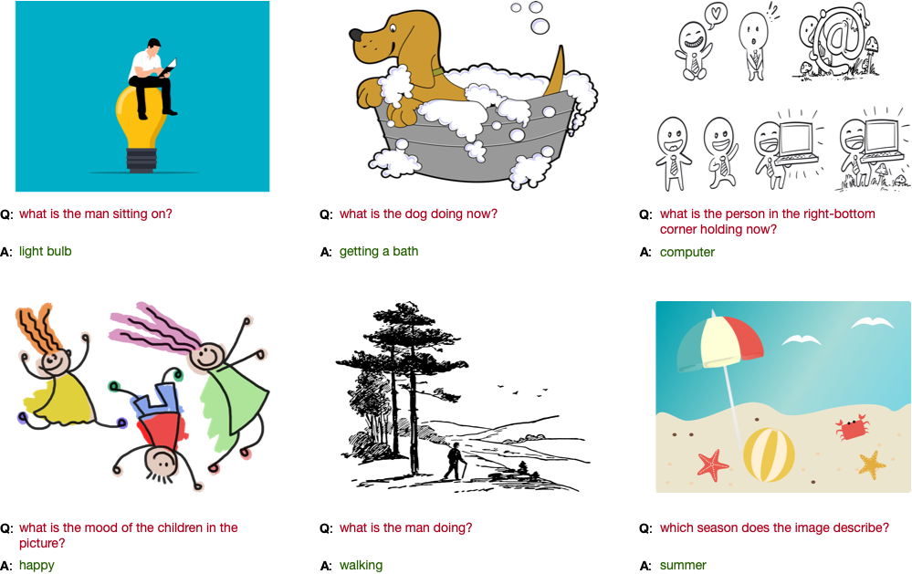

# OFA

[[Paper]](http://arxiv.org/abs/2202.03052) [Blog] [Colab]


OFA is a unified multimodal pretrained model that unifies modalities (i.e., cross-modality, vision, language) and tasks 
(e.g., image generation, visual grounding, image captioning, image classification, text generation, etc.) 
to a simple sequence-to-sequence learning framework. For more information, please refer to our paper: [Unifying Architectures, Tasks, and Modalities Through a Simple Sequence-to-Sequence Learning Framework](http://arxiv.org/abs/2202.03052).

We plan to release the code and colab notebooks soon (Feb. 2022). 


# Approach


# Examples
Below we provide examples of OFA in text-to-image generation and open-ended VQA. Also, we demonstrate its performance in unseen task (Grounded QA) as well as unseen domain (Visual Grounding on images from unseen domains). 

## Text-to-Image Generation (normal query)


## Text-to-Image Generation (counterfactual query)


## Open-Ended VQA


## Grounded QA (unseen task)


## Viusal Grounding (unseen domain)


# Citation
Please cite our paper if you find it helpful:)

```
@article{wang2022OFA,
  title={Unifying Architectures, Tasks, and Modalities Through a Simple Sequence-to-Sequence Learning Framework},
  author={Peng Wang, An Yang, Rui Men, Junyang Lin, Shuai Bai, Zhikang Li, Jianxin Ma, Chang Zhou, Jingren Zhou and Hongxia Yang},
  journal={arXiv e-prints},
  pages={arXiv--2202},
  year={2022}
}
```
